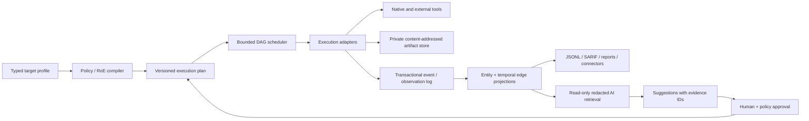

# Quarry v0.3.9 — code, security, architecture, and market audit

**Audit date:** 2026-08-09  
**Snapshot:** the disposable copy supplied in `/home/kali/audits/codex/quarry`  
**Audited release:** `quarry-recon` 0.3.9  
**Purpose:** determine what blocks foundational reliability now and define a credible route to a market-leading reconnaissance framework.

> **Product-context revision (2026-08-10):** the owner clarified that Quarry intentionally performs broad, high-scale, authorized active verification and accepts the current Nuclei request set. [AUDIT_CROSS_REFERENCE.md](AUDIT_CROSS_REFERENCE.md) is the controlling disposition for policy-dependent findings. In particular, Q-C01 is withdrawn as a Critical defect/release blocker: keep the scan, label it accurately, freeze one reproducible corpus per run, and emit complete policy/template provenance. The request-semantic evidence below remains factual.

## Executive decision

Quarry is not yet ready to be represented as a production-grade, high-scale bug-bounty framework. It has a genuinely differentiated evidence and coverage model, but deterministic correctness, finalization, recovery, resource, installer, and concurrency defects can still lose evidence or report a false result. The broad Nuclei lane is an accepted active product capability under the clarified contract; its remaining defects are inaccurate “non-intrusive” wording and inability to prove the exact corpus that ran.

The next blockers are systemic rather than cosmetic: private-network reach is permissive by default; DNS validation is separated from the actual connection; hostile responses and tool output are not bounded; run data containing discovered secrets inherits public umask permissions; several failures still finalize as `complete`; settlement corrupts “latest run” lookup; finished runs can be mutated without updating their manifest; the subprocess deadline is not a deadline; and installer checksum verification can be raced before privileged extraction.

This does not mean the design should be discarded. Quarry already does several things better than typical recon wrappers: it preserves raw evidence, attaches provenance, distinguishes execution from coverage, models remainders and paid acquisition, centralizes scope intent, pins direct tool identities, and documents why work was omitted. Those are valuable foundations. The correct v0.3.x strategy is to **stabilize and simplify before adding more tools, AI, a server, or collaboration**.

### Release recommendation

- **Keep the default Nuclei main scan**, replace the inaccurate label, and freeze/fingerprint the exact current corpus and policy for every run without adding an interactive prompt.
- Treat v0.3.10 as a safety/correctness release only. Do not add recon breadth.
- Do not expose Quarry as a daemon, multi-user API, MCP service, or autonomous AI agent until explicit run context, tenant isolation, transactional state, and mediated capabilities replace process globals and path-based trust.
- Preserve the raw-evidence/provenance/coverage concepts while replacing ad-hoc dictionaries and whole-file projection with versioned schemas and a transactional repository.

### Consolidated severity

| Severity | Meaning in this audit | Confirmed themes |
|---|---|---|
| **Critical** | Default or ordinary operation can cause unauthorized high-impact action | none under the clarified authorized-active product contract; original Q-C01 is retired at this severity |
| **High** | Serious scope, confidentiality, availability, or integrity loss under a realistic prerequisite | private-network reach, DNS rebinding, unbounded acquisition, public evidence permissions, false completion, run/campaign corruption, runner hangs/OOM, installer races, unsafe concurrency |
| **Medium** | Material defect with a narrower prerequisite or bounded impact | OOB token entropy, DNS thread leakage, mutable supply-chain data, platform defects, stale status, ReDoS, report/config injection, weak durability |
| **Low** | Clarity, governance, or future-hardening gap | dead metadata, misleading contracts, missing snapshot governance artifacts, smaller output correctness defects |

The classification is contextual, not CVSS. A local CLI traversal is low today because the operator already controls the filesystem, but becomes high at an API boundary. The original Critical Nuclei disposition assumed the advertised “non-intrusive” contract meant non-mutating; the owner has now established that broad active verification is intentional and authorized, so the remaining label/provenance defect is Medium.

## Scope, method, and limitations

I reviewed all 49 Python modules (29,417 physical lines), the packaged registries and templates, installer, shell bootstrap, CLI, and 18 documentation files. The review combined:

- execution/data-flow and trust-boundary mapping;
- line-by-line review of scope, fetch, subprocess, storage, campaign, budget, OOB, installer, and phase code;
- static structural measurements and import/compile checks;
- disposable local characterization tests and fault injection;
- offline Nuclei template selection against the installed official template set;
- installer/path/permission/process/DNS harnesses that did not contact targets;
- comparison with current official reconFTW, BBOT, subfinder, httpx, and Nuclei documentation and releases;
- cross-checking against OWASP, MITRE CWE, NIST, W3C, OASIS, SLSA, PostgreSQL, Python, and peer-reviewed USENIX research.

The supplied snapshot intentionally omits the project's existing test suite. **No conclusion about upstream test count, coverage percentage, or test quality is drawn from that omission.** The tests added here are audit characterization only. No live target was scanned, and no exploit template was executed; Nuclei's list-only mode was used. Claims about exploit impact are based on the exact selected template request bodies plus the vulnerable-target prerequisite. Third-party versions and capabilities are current as of the audit date and should be rechecked later.

### Verification summary

| Check | Result |
|---|---|
| Python compilation | all audited modules compiled |
| module import sweep | all discoverable modules imported |
| source/tool registry load | 66 sources and 38 tools loaded |
| audit characterization suite | **15 passed** in approximately 1.2–1.4 s on repeated validation runs |
| independent-audit cross-reference suite | **6 passed**; combined audit harness **21 passed** in 1.44 s on final validation |
| Nuclei list-only policy test | three mutating/RCE templates selected by Quarry's exact default filters |
| 32 MiB runner output harness | approximately 100.7 MiB Python peak allocation, about 3.0× output size |
| default umask harness | run directory `0755`; normalized secret file `0644` |
| hard-timeout harness | 0.1–0.2 s timeout waited for an escaped descendant until its pipe closed |
| DNS timeout harness | 80 timed-out queries left 80 still-running resolver threads |

The reproducible audit harness is [audit_tests/test_verified_findings.py](audit_tests/test_verified_findings.py). Run it with:

```bash
PYTHONPATH=src pytest -q audit_tests/test_verified_findings.py -vv
```

## What Quarry already does well

These strengths should survive the remediation work:

1. **Evidence honesty.** Raw artifacts, normalized observations, provenance references, alternates, first/last-seen timestamps, and coverage events form a stronger evidentiary story than flat text pipelines. The distinction between a tool finishing and a lane covering its eligible work is particularly valuable.
2. **Failure vocabulary.** `success`, `empty`, `partial`, `blocked`, `timed_out`, `failed`, and `skipped`, plus provider entitlement/quota distinctions, are more expressive than a binary exit-code wrapper.
3. **Scope intent.** Strict apex matching, IDNA canonicalization, manual redirect handling, sensitive-header stripping, OSINT-as-candidate separation, and opt-in switches for secret verification, blind XSS, deep evidence, and AST evaluation show strong safety intent.
4. **Acquisition and provenance controls.** Several migrated fetch paths use exclusive/no-follow files, `0600`, receipts, byte counts, and digests. GitHub and Dalfox temporary secret handling and the sandboxed JXScout AST lane are good patterns to standardize.
5. **Paid-data accounting.** Entitlement, reserve, acquisition ownership, purchased evidence reuse, rotations, and remainder modelling are unusually deliberate for an early recon framework.
6. **Direct tool identity.** All 38 registry entries have a version, exact ref, or explicit distro policy; managed Go/source/binary commands do not resolve to `@latest` after pin rewriting. This is materially better than unversioned installer scripts, although it is not yet a reproducible transitive build.
7. **Operator documentation.** Configuration, scope, phases, outputs, failure semantics, OOB, tuning, and recovery receive substantial explanation. The quality issue is consistency and broken rationale links, not an absence of operator intent.

## Findings register

`V` means dynamically verified in a harmless harness; `S` means source-confirmed; `R` means corroborated by authoritative external material; `I` means the final impact includes a stated inference.

| ID | Severity | Type | Finding | Proof |
|---|---|---|---|---|
| Q-C01 | Retired Critical; Medium gap | Product contract / reproducibility | Broad active Nuclei policy is mislabeled “non-intrusive” and cannot prove the exact per-run corpus | V/S/R |
| Q-H01 | High | Scope security | RFC1918/ULA/CGNAT contact is allowed by default without authorized-CIDR intersection | S/R |
| Q-H02 | High | SSRF / scope | DNS check/use gap, proxy inheritance, and fail-open indeterminate DNS permit rebinding bypass | S/R |
| Q-H03 | High | Availability | Hostile HTTP bodies can stream without a byte quota until timeout/disk exhaustion | S/R |
| Q-H04 | High | Confidentiality | Runs, OSINT, OOB state, normalized secrets, and exports inherit umask (`0755`/`0644`) | V/S/R |
| Q-H05 | High | Functional | `recon/campaigns` is selected as the latest run and corrupts delta selection | V/S |
| Q-H06 | High | Data integrity | Late OOB observations mutate a finalized run without manifest/history/report refresh | V/S |
| Q-H07 | High | Correctness | Event loss, checkpoint warnings, and missing dependencies can still yield `complete` | V/S |
| Q-H08 | High | Availability / evidence | Runner buffers whole streams/input, rejects non-UTF-8 bytes, and misses parent memory | V/S |
| Q-H09 | High | Availability | Timeout drain is unbounded; escaped descendants can defeat the wall-clock deadline | V/S |
| Q-H10 | High | Functional / UX | Unknown phases create empty successful runs; duplicates/order are not validated | V/S |
| Q-H11 | High | Automation | Run, OSINT, doctor, install, and campaign degradation can exit zero | V/S |
| Q-H12 | High | Campaign correctness | Fixed-point ordering, incomplete silence roster, and no crash resume undermine settlement | V/S |
| Q-H13 | High | Installer security | Predictable shared-temp archives are re-opened after verification, including by root `tar` | V/S/R/I |
| Q-H14 | High | Installer integrity | Required bootstrap/data/extras failures are discarded and activation is not rollback-safe | V/S |
| Q-H15 | High | Supply chain / secrets | Runtime executes a PATH shadow, not the verified receipt target, and leaks global env to every tool | V/S/R |
| Q-H16 | High | Config correctness | YAML/settings lack an exact schema; wrong shapes crash and coercions permit dangerous values | V/S |
| Q-H17 | High | Architecture / concurrency | Process-global sinks/settings/cancellation plus an unlocked ledger produce cross-run and lost-update risk | V/S |
| Q-M01 | Medium | OOB integrity | Correlation tokens have only 32 random bits | S/R |
| Q-M02 | Medium | Availability | DNS timeout abandons threads and can accumulate an unbounded resolver backlog | V/S |
| Q-M03 | Medium | Supply chain | Wordlists/resolvers/GF/Nuclei templates and Python transitives are mutable/unlocked | S/R |
| Q-M04 | Medium | Installer integrity | `curl` accepts HTTP errors, overwrites live data directly, and does not validate content | V/S/R |
| Q-M05 | Medium | Runtime integrity | Source-wrapper receipts omit the mutable payload actually executed | S |
| Q-M06 | Medium | Portability | Claimed best-effort macOS and cross-distro support conflicts with Linux-hardcoded artifacts/commands | V/S |
| Q-M07 | Medium | Status correctness | A new tool start retains the previous terminal state | V/S |
| Q-M08 | Medium | Architecture | Direct `exec_tool` and contract execution form two inconsistent control planes | S |
| Q-M09 | Medium | Durability | Manifest verifies counts, not content; atomic writes lack unique temp names and fsync | S |
| Q-M10 | **High under the clarified high-scale contract** | Performance | JSONL folding, live entity retention, campaign union, and exports materialize/amplify the full corpus | V/S |
| Q-M11 | Medium | Rate/integrity | Native pacing is not a shared limiter; identical fetches lack an ownership lock | S |
| Q-M12 | Medium | Config availability | Arbitrary Python OOS regex can catastrophically backtrack | S |
| Q-M13 | Medium | Scope/config integrity | Provider-controlled OSINT values can escape commented YAML into active configuration | V/S |
| Q-M14 | Medium | Path security | Run/campaign IDs can traverse storage boundaries; low locally, high at an API boundary | V/S |
| Q-M15 | Medium | Privacy | Public Interactsh is the default; tokens can be in argv; local session maps are sensitive | S |
| Q-M16 | Medium | Finalization | Post-processing is uncontained and non-resumable; a late failure leaves ambiguous run state | S |
| Q-M17 | Medium | Professionalism | Large monoliths, partial typing, missing schema/plugin contracts, and broken design links impede change | S |
| Q-L01 | Low | Output safety | Untrusted values can manipulate Markdown reports and future HTML/AI consumers | S |
| Q-L02 | Low | Correctness | `scoped_headers` cannot distinguish an exactly capped body from truncation | S |
| Q-L03 | Low | Installer UX | Dry-run writes directories; `update:` registry metadata is dead/misleading | V/S |

## Superseded Critical disposition; accepted active capability

### Q-C01 — ordinary Nuclei execution is not non-intrusive

The main Nuclei command calls the installed default template corpus and excludes only four metadata tags:

```python
# src/quarry_recon/phases/params.py:640-653
cmd = ["nuclei", "-l", str(targets_file), "-jsonl", "-o", str(out_file),
       "-etags", "intrusive,fuzz,dos,brute-force",
       "-s", "critical,high,medium", ...]
```

The docstring calls this “non-intrusive” ([params.py:640-653](src/quarry_recon/phases/params.py#L640)), while installation floats the corpus with `nuclei -update-templates` ([bootstrap.yaml:218-220](src/quarry_recon/data/bootstrap.yaml#L218)). Against the installed signed official templates v10.4.6, Quarry's exact filter selected the following with local Nuclei engine v3.8.0. The registry pins v3.11.0; the decisive evidence is also static: each file's declared severity is selected and none of its declared tags is excluded.

```text
http/vulnerabilities/springboot/springboot-h2-db-rce.yaml
http/vulnerabilities/thinkphp/thinkphp6-arbitrary-write.yaml
http/vulnerabilities/yonyou/yonyou-u9-patchfile-upload.yaml
```

The first sends a `POST /actuator/env`, installs an H2 alias, and calls `whoami`; the second uses a crafted session cookie to create a PHP file; the third uploads an executable `.ashx`, requests it, and attempts self-deletion. None has one of Quarry's four excluded tags. Reproduce selection without touching a target:

```bash
nuclei -tl \
  -etags intrusive,fuzz,dos,brute-force \
  -s critical,high,medium -silent 2>/dev/null \
  | rg 'springboot-h2-db-rce|thinkphp6-arbitrary-write|yonyou-u9-patchfile-upload'
```

ProjectDiscovery describes templates as community-contributed execution logic and provides tag/ID/exclusion controls; its signing mechanism authenticates integrity and authorship, not non-mutating behavior. [Nuclei execution/filter documentation](https://docs.projectdiscovery.io/opensource/nuclei/running), [template signing documentation](https://docs.projectdiscovery.io/templates/reference/template-signing), and the official [Spring Boot RCE](https://github.com/projectdiscovery/nuclei-templates/blob/main/http/vulnerabilities/springboot/springboot-h2-db-rce.yaml) and [Yonyou upload](https://github.com/projectdiscovery/nuclei-templates/blob/main/http/vulnerabilities/yonyou/yonyou-u9-patchfile-upload.yaml) templates directly support this conclusion.

**Prerequisite and impact.** Active mode, Nuclei/templates installed, and a matching vulnerable target are required. If matched, the run can change target state or execute commands. Under the clarified product contract this is intentional authorized verification, not a vulnerability in Quarry. It still must be disclosed precisely because `medium` describes finding severity—not aggressiveness—and a tag denylist cannot prove request semantics. GET-only linting would not be sufficient because state can be changed through headers/cookies and unsafe GET endpoints.

**Revised remediation with zero coverage reduction.** Keep the lane and exact filters. Call it “Broad active vulnerability verification (medium–critical templates; excludes intrusive, fuzz, DoS, and brute-force tags). Matching vulnerable targets may experience state changes, file writes, or command execution. Authorized targets only.” Version the unchanged flags as a machine-readable policy. Update once in preflight, atomically snapshot that corpus, list the exact filtered selection, and run all chunks against it with `-duc`. Record engine/config/ignore/corpus/payload/selected-template identities and digests in `nuclei-policy.json`; bind its digest to resume identity. Classify suspicious request semantics for non-blocking inventory and engagement overrides, not default filtering. See the cross-reference for the complete provenance design.

This change is important for market leadership: a professional high-scale hunting tool can run aggressively while making potentially state-changing verification accurate, attributable, reproducible, and reviewable.

## High-severity security and availability findings

### Q-H01 — private/LAN contact is a default capability, not an authorized exception

`netguard` blocks loopback, link-local, metadata, and a snapshot of the scanner's own addresses, but intentionally permits RFC1918, CGNAT, and IPv6 ULA addresses ([netguard.py:25-91](src/quarry_recon/netguard.py#L25)). The shipped profile sets `BLOCK_PRIVATE_TARGETS: false` ([target.template.yaml:44-54](src/quarry_recon/data/target.template.yaml#L44)). `ScopeMatcher.active_allowed()` establishes hostname/apex membership, not whether the resolved IP intersects an engagement-authorized CIDR ([config.py:120-143](src/quarry_recon/config.py#L120)). Probe then feeds allowed resolutions to httpx/naabu ([probe.py:1607-1626](src/quarry_recon/phases/probe.py#L1607)).

**Prerequisite.** An authorized hostname resolves—maliciously, accidentally, or through stale DNS—to an internal address reachable from the VPS/VPN. That is a realistic trust boundary because an in-scope target controls its DNS.

**Impact.** Quarry may enumerate or exploit services inside the scanner's LAN/VPC or another tenant even though the engagement did not authorize that address range. The behavior is documented, but documentation does not make an unsafe default professionally acceptable.

**Fix.** Default-deny every non-global destination and special-use range. Add a separate `ALLOW_PRIVATE_CIDRS` whose values must be explicit, canonical, and intersect the engagement CIDR; record each private-contact decision. Put the scanner in a network namespace/container with an egress firewall that blocks local, metadata, control-plane, and scanner-own networks independent of application code. OWASP recommends validating all A and AAAA answers and denying local/private destinations for attacker-influenced requests ([SSRF Prevention Cheat Sheet](https://cheatsheetseries.owasp.org/cheatsheets/Server_Side_Request_Forgery_Prevention_Cheat_Sheet.html)).

### Q-H02 — DNS validation is not bound to the connection

The module acknowledges that Nuclei/Dalfox/Arjun may resolve again after validation ([netguard.py:8-13](src/quarry_recon/netguard.py#L8)). `contact_state()` resolves and approves one answer, then native urllib or a child tool independently resolves the hostname at connection time ([netguard.py:182-197](src/quarry_recon/netguard.py#L182), [fetch.py:95-148](src/quarry_recon/fetch.py#L95)). `guard_hosts()` also lets `indeterminate` DNS pass to tools ([netguard.py:227-253](src/quarry_recon/netguard.py#L227)). Native urllib inherits environment proxy configuration unless it is explicitly disabled, adding another resolver and trust boundary.

An authoritative DNS server can answer with a public address during the check and loopback, metadata, an internal service, or the scanner's own address during the connection. The peer can also change through redirects or a proxy. The USENIX Security 2024 study identifies DNS rebinding as the evasion of IP validation and concludes that a robust implementation resolves once and uses the validated address; it also recommends revalidation on each redirect ([“SSRF vs. Developers,” pp. 4–5](https://www.usenix.org/system/files/usenixsecurity24-wessels.pdf)).

**Fix.** Fail closed on indeterminate resolution. Resolve all A/AAAA answers through a controlled resolver, approve one vetted address, connect to that address while preserving Host/SNI, and verify the peer address. Disable unintended proxy inheritance or explicitly validate the proxy path. Refresh scanner-own/VPN addresses, do not cache them at import. Most importantly, enforce destination denial below the process (firewall/network namespace) so third-party tools cannot bypass Python checks.

### Q-H03 — hostile bodies have no acquisition ceiling

`stream_to_file()` explicitly states “No byte ceiling” ([contract.py:168-201](src/quarry_recon/contract.py#L168)). `scoped_get_file()` streams for up to 300 seconds and intentionally retains partial output ([fetch.py:469-534](src/quarry_recon/fetch.py#L469)); exposed-resource, GraphQL, OpenAPI, Actuator, and deep-evidence paths use it ([evidence.py:718-991](src/quarry_recon/evidence.py#L718)). The 64 MiB parser cap limits later parsing, not transfer. A one-time pre-run free-space check is not a quota.

At 1 Gbit/s, a five-minute theoretical stream is roughly 37.5 GB. Several parallel in-scope endpoints can fill the run filesystem and impair the host. This is CWE-400 resource exhaustion ([MITRE CWE-400](https://cwe.mitre.org/data/definitions/400.html)); OWASP's logging guidance also calls for protection against storage exhaustion ([Logging Cheat Sheet](https://cheatsheetseries.owasp.org/cheatsheets/Logging_Cheat_Sheet.html)).

**Fix.** Introduce layered budgets: per response, artifact class, host, phase, run, and project. Reject excessive `Content-Length`, but still enforce a streaming counter because length can be absent or false. Check a reserved free-space floor during writes, stop at `limit + 1`, keep a small marked partial artifact, and emit `coverage=limited` with exact acquired/omitted bytes. Deep evidence may have a larger explicit cap, never “unbounded.”

Conceptually:

```python
def copy_bounded(src, dst, *, max_bytes, reserve_bytes):
    total = 0
    while chunk := src.read(min(64 * 1024, max_bytes + 1 - total)):
        if total + len(chunk) > max_bytes or disk_free(dst) < reserve_bytes:
            raise AcquisitionLimited(total=total, limit=max_bytes)
        dst.write(chunk)
        total += len(chunk)
    return total
```

### Q-H04 — sensitive project evidence is public under a normal umask

`Run.__init__` uses ordinary `mkdir` ([store.py:414-439](src/quarry_recon/store.py#L414)); observation append and generic atomic writes do not set restrictive modes ([store.py:383-389](src/quarry_recon/store.py#L383), [store.py:562-564](src/quarry_recon/store.py#L562)). OSINT, reports, raw output, OOB session/callback state, and exports follow the same model. Quarry intentionally stores full discovered secret values and exports them ([exports.py:60-65](src/quarry_recon/exports.py#L60)).

The audit harness confirmed a `0755` run directory and `0644` normalized secret/export under umask `022`. A private ancestor sometimes mitigates this, but Quarry permits a profile in any project path and does not enforce the ancestor. On a shared VPS, CI runner, backup mount, or future service worker, another local principal may read discovered credentials, PII, callback mappings, and raw HTTP evidence.

**Fix.** Create project/run/OSINT/OOB directories as `0700` and sensitive artifacts as `0600` using descriptor-based no-follow creation, including atomic replacements. Validate owner/type/mode of existing `secrets.yaml`; the installer currently protects only a newly created file. Separate a private evidence vault from deliberately redacted, shareable exports. Add sensitivity and retention labels now; collaboration later needs per-workspace authorization, encrypted storage, audited reads/exports, and revocation. OWASP advises least-privilege secret access and excluding raw tokens/secrets from general logs ([Secrets Management](https://cheatsheetseries.owasp.org/cheatsheets/Secrets_Management_Cheat_Sheet.html), [Logging](https://cheatsheetseries.owasp.org/cheatsheets/Logging_Cheat_Sheet.html)).

### Q-H15 — verified install identity is not runtime identity

The registry performs meaningful receipt/hash/source checks ([registry.py:290-348](src/quarry_recon/registry.py#L290)), but `runner.have()` only calls `shutil.which()` and `runner.run()` executes `cmd[0]` from the current PATH ([runner.py:335-336](src/quarry_recon/runner.py#L335), [runner.py:558-590](src/quarry_recon/runner.py#L558)). Readiness checks only an `installed` state. A harness prepended a fake `httpx`; Quarry executed the shadow even though it was not the receipt target.

`secrets.apply_env()` puts `PDCP_API_KEY` in the process environment globally ([secrets.py:214-219](src/quarry_recon/secrets.py#L214)), and every child inherits the full environment unless overridden. The same shadow harness received the canary PDCP key. Shodan and Interactsh credentials also appear in argv on some paths, visible to other local users on common Linux configurations.

**Fix.** At planning time resolve each approved executable to an absolute path, match its receipt/digest/module/version, and freeze that identity in `RunContext`; fail on drift. Spawn from a minimal environment plus a per-tool allowlist. Deliver a secret only to its consumer through a `0600` config, stdin, or inherited file descriptor; never global env or argv where avoidable. Python confirms that omitting `env` causes children to inherit the current environment ([subprocess documentation](https://docs.python.org/3/library/subprocess.html)).

## High-severity functional and data-integrity findings

### Q-H05 — campaigns break “latest run” and delta selection

`Run.latest()` enumerates every directory under `recon/` except `state`, sorts it, and attempts to open it ([store.py:968-988](src/quarry_recon/store.py#L968)). A settle campaign creates the reserved `recon/campaigns/` container, which sorts after timestamp-like runs and has no `run.json`/manifest. The harness produced:

```text
ValueError: run 'campaigns' has no readable run.json/manifest
```

Default `status`, `report`, `oob poll`, and `oob import` therefore fail after settlement. Delta generation independently repeats the same faulty enumeration ([exports.py:29-47](src/quarry_recon/exports.py#L29)), so it can also choose the wrong previous run.

**Fix.** Centralize `Run.list_runs()`: enforce a minted opaque ID grammar, require contained non-symlink directories and valid immutable creation metadata, exclude reserved namespaces, and order by parsed start time plus ID. Use it everywhere, with an atomically maintained current-run pointer only as a cache.

### Q-H06 — late OOB callbacks make a finished run self-contradictory

OOB import/poll reopens and appends `oob_interaction` observations ([cli.py:1177-1234](src/quarry_recon/cli.py#L1177), [store.py:507-565](src/quarry_recon/store.py#L507)). The code does not update manifest counts, summary, history, delta, digest, or reports. The harness finalized at zero, added one callback, and observed the manifest still claiming zero while the folded store returned one/degraded. Campaign verification may reject the run while an export consumes the new row.

**Fix.** Finished runs should be immutable. Put delayed callbacks in a separately manifested append-only supplement or create a new run revision/generation. A materialized view may combine the base snapshot and supplements, but its version, input digests, counts, and reports must update transactionally. This also establishes the event/revision model future collaboration needs.

### Q-H07 — several known gaps are laundered into `complete`

Three independent paths undermine the verdict:

- `write_manifest()` computes summary before attaching event-sink degradation, and `_run_summary()` ignores that state ([store.py:708-711](src/quarry_recon/store.py#L708), [store.py:918-947](src/quarry_recon/store.py#L918)). Simulated event-write failures produced `complete` with `writes_failed > 0`.
- Checkpoints that challenge a result—such as passive discovery returning zero—become prose notes; only notes containing `EXCEPTION` affect summary ([cli.py:969-995](src/quarry_recon/cli.py#L969), [store.py:667](src/quarry_recon/store.py#L667)).
- Missing required Interactsh is recorded under `oob_probe`, so binary-name reconciliation does not recognize `interactsh-client` as missing and can still report complete ([params.py:2238](src/quarry_recon/phases/params.py#L2238), [store.py:620](src/quarry_recon/store.py#L620)).

**Fix.** Replace prose-driven correctness with typed `Fault`/`Gap` records: stable code, source/work unit, severity, whether completeness is challenged, eligible/tested/omitted counts, evidence, and remediation. Calculate the verdict once, after every event/finalization fault has been transactionally recorded. Missing source-to-tool dependencies must be explicit registry edges, not inferred by equal names.

### Q-H08/Q-H09 — the subprocess boundary is not safe for recon-scale data

The runner reads a whole input file, uses text-mode PIPEs, buffers complete stdout and stderr in `communicate()`, and only then writes artifacts ([runner.py:546-669](src/quarry_recon/runner.py#L546)). Consequences verified in the audit:

- a child writing `b'\xff'` raises `UnicodeDecodeError`, aborting the calling phase and losing the promise of exact raw evidence;
- 32 MiB stdout drove approximately 100.7 MiB of Python peak allocation; the child-only RSS telemetry reported none of that parent amplification;
- after a timeout, the runner kills its process group and calls unbounded `communicate()` again. A descendant that started a new session and retained the pipe held a 0.1–0.2 s call for 0.8–1.6 s; a daemon can hold it indefinitely;
- launch `OSError`, input-read, and artifact-publication failures escape instead of becoming a typed `RunResult`; `ok_empty` is accepted but ignored.

**Fix.** Use binary mode and direct file descriptors for stdin/stdout/stderr. Stream exact bytes into unique private staging artifacts while maintaining an incremental digest, byte count, bounded stderr tail, and optional parser stream. Apply one absolute deadline across execution, termination, and drain; after a bounded grace, close pipes and return partial evidence. Contain descendants with cgroups/pidfds/subreaper where supported. Measure the entire run worker/cgroup, not only direct descendants. Catch launch/publication errors into a machinery-failure result.

The target interface should be small and explicit:

```python
ExecutionResult = execute(
    executable=approved_absolute_path,
    argv=validated_args,
    stdin=stream_or_path,
    stdout=ArtifactPolicy(max_bytes=..., binary=True),
    stderr=TailPolicy(max_bytes=...),
    deadline=absolute_monotonic_deadline,
    env=tool_specific_environment,
    context=run_context,
)
```

### Q-H10/Q-H11 — CLI validation and exit semantics are unsafe for automation

The CLI creates a run and configures global state before it filters unknown phases ([cli.py:892-905](src/quarry_recon/cli.py#L892)). `--phases typo` executed nothing, finalized a manifest with `phases_run: []`, printed success, and exited zero. Duplicates can execute twice; arbitrary order can starve downstream phases of inputs. Invalid doctor/install selectors can select zero checks and also succeed.

`complete_with_gaps`, doctor `NOT READY`/`DEGRADED`, OSINT gaps, settlement faults, and required bootstrap failures commonly print a warning but return zero ([cli.py:1009-1064](src/quarry_recon/cli.py#L1009)). This makes CI and orchestration unable to gate on truth.

**Fix.** Validate and normalize every selector before side effects using an exact choice/schema; reject unknown, empty, duplicate, or dependency-invalid phase plans. Preserve canonical order unless an explicitly dangerous override is used. Publish a stable machine-readable result and exit contract, for example:

| Exit | Meaning |
|---:|---|
| 0 | complete under selected policy |
| 2 | invalid input/configuration |
| 3 | completed with declared soft limits |
| 4 | completed with gaps/unknown coverage |
| 5 | machinery/finalization failure |
| 6 | authorization/safety policy refused |

### Q-H12 — settlement cannot reliably prove convergence or recover

`decide()` checks `max_children` before terminal/fixed-point state, so a true fixed point reached by the last permitted child is mislabeled `max_runs` ([campaign.py:473-487](src/quarry_recon/campaign.py#L473)). The first child starts with no expected remainder roster ([settle.py:117-123](src/quarry_recon/settle.py#L117)), so total silence can be mistaken for convergence despite the design rule “silence is unknown.” Later checks track lane names, not exact `(lane, unit, measure)` obligations. Finally, any interrupted campaign with children is unconditionally rejected instead of resumed ([settle.py:52-55](src/quarry_recon/settle.py#L52)).

**Fix.** Build the applicability/obligation roster from the selected plan before child one. Require each obligation to emit known zero, retriable remainder, terminal debt, or explicit not-applicable. Evaluate terminal and fixed-point meaning before asking whether another child would exceed a budget. Make every campaign transition idempotent, lease-owned, digest-checked, and recoverable after process death.

### Q-H13 — checksum verification is separated from privileged archive use

Go installation uses a predictable shared path, hashes it by name, removes the live toolchain, and later has root reopen the same name:

```text
wget ... -O /tmp/go.tgz
sha256sum -c /tmp/go.tgz
sudo rm -rf /usr/local/go
sudo tar -C /usr/local -xzf /tmp/go.tgz
```

See [bootstrap.py:177-190](src/quarry_recon/bootstrap.py#L177). A co-resident attacker can pre-place a symlink to an attacker-owned writable target or race bytes after verification and before root `tar` opens the file. A harmless canary confirmed that Wget follows and truncates a pre-planted symlink target. Root code execution is the reasoned impact if the attacker wins the verify/use window and supplies a malicious tar; it was not attempted.

Fixed shared archives recur for Bun, Gitleaks, TruffleHog, and Dalfox ([tools.yaml:219](src/quarry_recon/data/tools.yaml#L219), [tools.yaml:462](src/quarry_recon/data/tools.yaml#L462), [tools.yaml:555](src/quarry_recon/data/tools.yaml#L555)); those can lead to same-user code execution because the installer probes staged executables. Predictable clone/build directories add DoS and unsafe-concurrency risk.

MITRE describes the relevant insecure temporary file and time-of-check/time-of-use classes in [CWE-377](https://cwe.mitre.org/data/definitions/377.html) and [CWE-367](https://cwe.mitre.org/data/definitions/367.html). Python's `tempfile` facilities exist specifically to create securely named private temporary files/directories ([tempfile documentation](https://docs.python.org/3/library/tempfile.html)).

**Fix.** Move archive acquisition/extraction out of manifest shell strings into one Python installer primitive. Create a `0700` private directory, create files with exclusive/no-follow semantics, verify from a stable descriptor, enumerate and reject traversal/symlink/device/duplicate/oversized members, extract without privilege, verify the exact expected executable, and use privilege only for an atomic directory swap with rollback. Never delete the current Go installation until the candidate has passed all checks.

### Q-H14 — required install failures and partial activation report success

`install_system_packages()` and `ensure_golang()` return Booleans, but the CLI discards them ([bootstrap.py:117-192](src/quarry_recon/bootstrap.py#L117), [cli.py:505-507](src/quarry_recon/cli.py#L505)). Data and extras do not return an aggregate result at all; Chromium failure and `apt-get update` are also absent from the final status. A harness made all required bootstrap stages fail and observed exit 0 plus `install complete — required tools ok`.

Binary/source activation replaces live payloads before all identity/receipt/PATH/capability checks complete; receipt writes are not atomic ([registry.py:481-548](src/quarry_recon/registry.py#L481)). An update can therefore destroy a known-good install and still leave a misleading receipt or wrapper.

**Fix.** Every install step should return `{id, required, status, artifact_identity, diagnostic, rollback}`. The CLI aggregates all required steps and exits nonzero. Stage the entire runtime closure, verify it, atomically switch a versioned pointer and receipt, then retain or garbage-collect the last-good version. Add a process-wide install lock and unique operation directories.

### Q-H16 — profiles and machine settings do not have a type boundary

`TargetProfile.load()` assumes the YAML root and nested values are mappings; wrong shapes leak `AttributeError`/`TypeError`/`YAMLError` while callers expect `ProfileError` ([config.py:338-418](src/quarry_recon/config.py#L338)). Scalar list fields can be iterated character by character; `int()` truncates/coerces values; `JS_AST` is omitted from eager flag validation; unknown keys are accepted. Machine concurrency similarly accepts booleans, truncates floats, and permits explicit values above documented caps ([settings.py:249-290](src/quarry_recon/settings.py#L249)).

**Fix.** Adopt a versioned JSON Schema 2020-12 or equivalent typed model with exact types, ranges, mutually dependent fields, unknown-key rejection, default expansion, and migrations. JSON Schema 2020-12 supplies a standard vocabulary and validation model ([specification](https://json-schema.org/draft/2020-12)). Parse every failure into a path-specific user error before any run state exists. Safety caps require a separate, conspicuous unsafe override rather than being bypassed by any explicit value.

### Q-H17 — current runtime state cannot safely host two runs

The event sink/generation, tool cwd, cancellation registry, settings overrides, and campaign acquisition state are process globals ([events.py:76-81](src/quarry_recon/events.py#L76), [runner.py:77-82](src/quarry_recon/runner.py#L77), [settings.py:18-52](src/quarry_recon/settings.py#L18), [campaign.py:47-71](src/quarry_recon/campaign.py#L47)). Concurrent in-process runs can cross-route events, share policy, use the wrong cwd, or cancel/close one another.

The generic paid-data `Ledger` also has a verified lost update: two instances loaded one file, recorded different entries, each saved successfully, and reopening retained only the last writer ([budget.py:750-767](src/quarry_recon/budget.py#L750), [budget.py:991-1051](src/quarry_recon/budget.py#L991)). Current call sites sometimes add an outer lock, but the API does not enforce ownership and is unsuitable for future daemon/collaboration use.

**Fix.** Introduce one explicit immutable `RunContext` containing workspace/engagement/run identity, validated policy, settings, event writer, cancellation domain, approved executables, rate limiters, artifact store, authorization principal, and secret broker. Pass it through every lane. Replace snapshot ledgers with database transactions, unique keys, leases/fencing tokens, and compare-and-swap or append-only journal semantics. Until that exists, run each scan in a separate OS process and advertise no in-process concurrency.

## Medium- and low-severity findings

### Q-M01 — OOB correlation has 32-bit capability entropy

`issue_token()` uses only `os.urandom(4)` and maps a callback to an exact target/parameter ([oob.py:282-334](src/quarry_recon/oob.py#L282)). With `k` live tokens and `q` guesses, the probability of hitting some live mapping is approximately `1 − exp(−kq/2^32)`; 10,000 mappings and roughly 300,000 guesses approach 50%. Public-server rate limits and smaller runs reduce feasibility, but the space is not appropriate for evidence attribution. A locally readable `session.json` makes forgery trivial.

Use at least 128 random bits or an HMAC over run/target/parameter/nonce, expire mappings, detect replay/rate anomalies, and retain raw callback evidence. OWASP recommends a 64-bit minimum and 128-bit tokens for custom session identifiers ([Session Management Cheat Sheet](https://cheatsheetseries.owasp.org/cheatsheets/Session_Management_Cheat_Sheet.html)).

### Q-M02 — DNS timeouts leak live threads

`resolve()` starts a daemon around blocking `getaddrinfo()` and returns on timeout without stopping it; `resolve_many()` layers a 16-thread executor on top ([netguard.py:125-179](src/quarry_recon/netguard.py#L125)). A harness with 80 delayed resolutions returned in 59 ms with 80 `indeterminate` results and 80 resolver threads still alive. A stuck NSS/DNS backend plus a hostile corpus can exhaust threads and continue mutating shared result state after the caller returns.

Use a resolver with enforceable per-query deadlines and a truly bounded outstanding-work queue, or isolate resolution in recyclable worker processes. Apply a total corpus/query budget and fail closed.

### Q-M03/Q-M04 — managed data is neither immutable nor transactionally refreshed

Resolver lists and wordlists are fetched from moving `main`, `master`, and gist URLs; GF patterns shallow-clone HEAD; Nuclei templates float ([bootstrap.yaml:178-220](src/quarry_recon/data/bootstrap.yaml#L178)). Python/build dependencies are lower-bound-only with no hash-complete lock ([pyproject.toml:1-23](pyproject.toml#L1)). Direct tool pins are real, but “pinned” does not describe the entire runtime or data graph.

`_curl_to()` uses `curl -sSL` without `--fail`, downloads directly over the last-good destination, accepts any nonempty content, and does not catch launch `OSError` ([bootstrap.py:54-64](src/quarry_recon/bootstrap.py#L54)). The audit harness wrote `404: Not Found`; Quarry accepted it as success. A corrupt resolver list can alter DNS trust and leak queries; an error page can silently erase coverage.

**Fix.** Pin immutable commits/releases and SHA-256 for every behavioral input; use HTTPS-only redirect policy; download to a private sibling, enforce size and grammar/cardinality, fsync, and atomically replace only on success. Generate hash-complete Python locks for supported platforms and a pinned build backend; capture full Go build/module identity. Produce an SBOM and build provenance. NIST's SSDF calls for protecting software and verifying artifacts throughout development ([SP 800-218](https://csrc.nist.gov/pubs/sp/800/218/final)); SLSA provenance records who built an artifact, how, and from which resolved dependencies ([SLSA build provenance](https://slsa.dev/spec/v1.2/build-provenance)).

### Q-M05 — receipts do not cover the executable closure

`jxscout-chunks` and `jxscout-ast` wrappers execute JavaScript/native payloads in a mutable share directory, while installed identity hashes only the wrapper ([tools.yaml:168](src/quarry_recon/data/tools.yaml#L168), [tools.yaml:245](src/quarry_recon/data/tools.yaml#L245), [registry.py:320](src/quarry_recon/registry.py#L320)). Changing the payload leaves a healthy receipt. Content-address the entire runtime closure and verify every payload hash, or package it as one immutable artifact.

### Q-M06 — the platform support statement is internally inconsistent

`current_platform()` hardcodes `linux/` even when `platform.system()` is Darwin ([registry.py:366-372](src/quarry_recon/registry.py#L366)); the harness returned `linux/amd64` for a mocked Mac. Darwin Go URLs exist but Darwin hashes do not; several commands require GNU utilities; Nmap is apt-specific; JXScout AST hardcodes a Linux x64 native module. DNF's `@Development Tools` is split in an unquoted shell string, and Pacman's `-Sy` risks an unsupported partial upgrade.

Either declare and test Linux-only support for v0.3.x, or build an explicit OS/architecture capability matrix with Darwin artifacts/hashes and CI. A “best-effort” label should not select an impossible binary format.

### Q-M07 — status retains an old terminal generation

`_fold_events()` does not clear status, duration, reason, or progress on `tool_start`; rendering prefers the stale terminal status ([views.py:84-147](src/quarry_recon/views.py#L84)). The verified sequence `finish(success) → start` still rendered `success`, not `running`. Key execution by `(source_id, work_unit, generation)` and reset lifecycle fields at each start; aggregate only after generation-specific state is correct.

### Q-M08 — two execution control planes weaken the registry contract

A static count found 34 direct `exec_tool()` calls and 15 `run_contract()` calls across phase code. Direct calls can bypass registry admission and structured lifecycle/status even when they later reach the manifest. Replace both with one `ExecutionAdapter` that always performs source lookup, policy authorization, approved-executable resolution, lifecycle events, acquisition/publication, classification, normalization, and structured fault recording. Complex lanes should provide callbacks, not bypass the boundary.

### Q-M09 — publication is atomic-looking, not durable or content-attested

Finished-run reconciliation compares folded entity counts, not content digests; an attacker or bug can change fields while preserving identity/count ([store.py:292-366](src/quarry_recon/store.py#L292)). `_atomic_write()` uses a PID-only temp name, performs no file/directory fsync, and can collide between threads ([store.py:383-389](src/quarry_recon/store.py#L383)). JSONL appends have no framing checksum, locking, or torn-tail protocol.

Record per-log digest, byte count, row count, schema version, and derivation inputs in the manifest. Use unique exclusive temp files, fsync file, replace, fsync directory, and a lock—or let a transactional database own commits. Content hashes should be chained to artifact receipts and revisions; signing can be added for exported attestations.

### Q-M10 — current projection algorithms will not scale with corpus size (promoted to High)

JSONL folding reads/splits whole files, `Run` retains merged dictionaries, list/provenance merges use repeated linear membership tests, and campaign union materializes both a complete line list and joined body for every child ([store.py:334-366](src/quarry_recon/store.py#L334), [campaign.py:284](src/quarry_recon/campaign.py#L284)). Sweep duplicates large sets/lists and rehashes words at each recursive level ([sweep.py:55-95](src/quarry_recon/sweep.py#L55), [sweep.py:312](src/quarry_recon/sweep.py#L312)). Each live tool's RSS sampler scans the full `/proc` table every 300 ms, multiplying overhead under concurrency.

The cross-audit characterization folded 100,000 unique URL rows from 9.70 MiB of JSONL with roughly 93 MiB traced Python peak allocation. A clean child run completed in 2.39 seconds with 115.81 MiB maximum RSS including interpreter/import baseline. These fixture results demonstrate full materialization and substantial memory amplification, not a universal rows/second benchmark. A derived SQLite/DuckDB index does not solve the live path while `Run.add()` still retains the complete merged corpus and exports rebuild whole sorted sets.

The run-level `ru_maxrss` value is a process-lifetime child high-water mark, not a run-local measurement ([metrics.py:14](src/quarry_recon/metrics.py#L14)); settlement children can inherit an earlier peak. Label it accurately until cgroup/work-unit metrics replace it.

Move routine write/read/query/export behavior to a disk-backed indexed repository (SQLite WAL is a credible first implementation), retain append-only JSONL as an audit/export journal if desired, stream rebuilds/exports, cache word hashes once, disk-partition large work sets, and use one cgroup/central sampler. Publish/enforce honest corpus/RSS limits in v0.3.x; remove O(N) routine live/reopen/status/report behavior in v0.4. Add fixture-based throughput, peak-RSS, artifact-growth, and campaign-complexity budgets before raising workload caps. No claim that Go tools are inherently faster is made; Quarry needs apples-to-apples benchmarks.

### Q-M11 — pacing and artifact ownership are not globally coordinated

Native `_pace()` sleeps independently, so concurrent callers can burst past an engagement-wide HTTP rate ([fetch.py:47](src/quarry_recon/fetch.py#L47)). `scoped_get_file()` has reconcile-then-fetch-publish without a per-artifact lease, so concurrent identical requests can both write. Place shared token buckets and artifact leases in `RunContext`; feed external-tool reservations into the same admission layer where practical.

### Q-M12 — operator regex can cause catastrophic backtracking

OOS accepts arbitrary Python regex and runs it against every hostname without a regex deadline or complexity/input cap ([config.py:124-130](src/quarry_recon/config.py#L124), [config.py:317-323](src/quarry_recon/config.py#L317)). The immediate prerequisite is a malicious/mistaken profile, but imported profiles and future collaborative edits increase exposure. Prefer exact host/suffix/glob rules; if regex remains, use a linear-time engine, cap length, and validate/test it before a run.

### Q-M13 — remote OSINT text can become active YAML

Provider-derived apex candidates are only loosely validated and are inserted into a commented suggested profile line-by-line ([osint.py:125-145](src/quarry_recon/osint.py#L125), [osint_report.py:86-113](src/quarry_recon/osint_report.py#L86)). A candidate containing a newline escaped the comment and injected an active `MODES:` block in the audit harness. Human review prevents automatic scope change, but a generated configuration is a security boundary.

Validate each candidate as its declared type (canonical domain/ASN/CIDR), reject controls/newlines, construct a typed object, and serialize through YAML. Reject duplicate keys when loading. Never generate configuration by interpolating untrusted lines.

### Q-M14 — identifiers are paths in disguise

`Run.open(project, target, run_id)` and `Campaign` join an unvalidated external ID to a storage directory ([store.py:466-478](src/quarry_recon/store.py#L466), [campaign.py:554-558](src/quarry_recon/campaign.py#L554)). A crafted `--run ../escaped` directory with metadata caused Quarry to materialize writable report/raw state outside `recon/`. A local operator normally already has equivalent filesystem rights, which limits present impact; at a service boundary this becomes tenant traversal.

Mint opaque IDs, enforce a strict regex, then require `candidate.resolve().is_relative_to(root.resolve())` before any mutation. Also use dirfd/openat-style no-symlink traversal. Authorization must bind `workspace_id + object_id`, never authorize by a caller-provided path.

### Q-M15 — OOB defaults trade convenience for privacy

The default public Interactsh pool receives callback content; auth may be passed on argv; session files map tokens to targets and parameters. This is a legitimate feature but should be an explicit data-transfer decision, particularly for confidential engagements. Default to self-hosted/disabled for sensitive work, require consent for public OOB, redact/localize state, use `0600`, and document provider retention/terms.

### Q-M16 — finalization is an uncontained single point of failure

Export, delta, triage, digest, metrics, and manifest publication occur after phase containment ([cli.py:984-1007](src/quarry_recon/cli.py#L984)). A parser or disk error can leave a run with no final manifest and a raw traceback, and there is no resumable finalization state. Model `created → running → finalizing → finished` with `finalization_failed` and idempotent per-view generations. The base evidence commit must remain valid even if a report fails.

### Q-L01/Q-L02/Q-L03 — smaller but real professionalism defects

- Target titles, URLs, provider values, and findings are interpolated into Markdown without robust control-character/Markdown sanitization. This can manipulate reports, trigger remote image loads, and become stored XSS when an HTML UI arrives. Encode at the renderer and apply CSP in a future UI.
- `scoped_headers()` reads exactly `max_body`, so it cannot tell whether data ended at the boundary or was truncated; read `limit + 1` and emit partial coverage ([fetch.py:537-575](src/quarry_recon/fetch.py#L537)).
- Install dry-run creates directories before checking `dry`; the registry loads `update:` metadata that the updater never consumes. Align behavior and documentation so operators can trust previews and schema meanings.

## Code-quality and professionalism audit

### Objective snapshot metrics

These metrics describe this supplied code snapshot; they are not test-coverage claims.

| Metric | Observed | Interpretation |
|---|---:|---|
| Python modules / physical lines | 49 / 29,417 | substantial framework, no longer a small script |
| classes / functions | 69 / 1,142 | broad surface area and many implicit contracts |
| functions fully annotated, excluding `self`/`cls` | 478 / 1,142 (41.9%) | typing is partial; public boundaries are not consistently machine-checkable |
| functions with docstrings | 789 / 1,142 (69.1%) | intent is often documented, but docstrings cannot substitute for schemas/tests |
| functions at least 100 lines | 36 | high review/change risk |
| functions at least 200 lines | 14 | material decomposition debt |
| largest sampled functions | `run_sweep` 478 lines; `_dalfox_xss_fast` 452; `_nuclei_scan` 295; `_wc_differentiate` 288; crawl `run` 284 | phase orchestration, policy, I/O, parsing, and reporting are intertwined |
| branch-complexity proxy at least 20 | 73 functions | approximate AST count, useful as a hotspot signal rather than formal cyclomatic complexity |
| local Markdown links checked | 67 | 5 broken, all under missing `docs/design/` rationale paths |
| packaged registry | 38 tools / 66 sources | impressive breadth, but source contract is only partially enforced at runtime |
| audit characterization | 15/15 passed | proves the undesirable behaviors; says nothing about omitted upstream coverage |

The largest phase modules are crawl (2,718 lines), probe (2,511), params (2,503), and vertical (1,513); CLI is 1,238 lines. This size is not automatically bad, but the hotspots combine orchestration, subprocess construction, state transition, parsing, and domain policy. A change to one concern can break the others, which is visible in the Nuclei safety label, OOB manifest drift, and campaign latest-run collision.

### Professional gaps in the supplied snapshot

- No dedicated `LICENSE`, `SECURITY.md`, `CONTRIBUTING.md`, changelog, or CI workflow was present in this snapshot, despite `pyproject.toml` declaring MIT text. These may exist outside the supplied copy; the finding is snapshot-specific.
- Five published documentation links point to an absent `docs/design/` tree, including the architecture's rationale references. Either ship those documents or remove/replace the links.
- Development dependencies name pytest only. The snapshot has no pinned formatter, linter, type checker, security scanner, dependency audit, mutation tool, or coverage gate configuration. That does not prove upstream does not run such tooling; it means the reproducible developer contract in this copy does not specify it.
- The source registry documents a strong contract, but direct execution bypasses parts of it. A declarative registry is professional only when runtime enforcement and validation are authoritative.
- Versioned data schemas, migrations, deprecation policy, machine-readable CLI schemas, public plugin API, and compatibility tests are absent. At v0.3.9 this is understandable, but adding AI/collaboration before them would cement accidental contracts.

### Maintainability recommendations

1. Define small boundary interfaces: `Repository`, `ArtifactStore`, `ExecutionAdapter`, `PolicyEngine`, `SecretBroker`, `RateLimiter`, `Plugin`, and `Clock`.
2. Make phase code declarative: select work units and adapters; do not construct policy, process, persistence, and reports in the same function.
3. Require exact typed inputs/outputs and error classes at every boundary. Avoid `dict` as the public model.
4. Set progressive gates rather than demanding perfection in one release: formatter/imports first; lint and schema checks; type-check public boundaries; then raise strictness module by module.
5. Use architectural fitness tests: no phase may call `subprocess` directly, no path ID may be joined unchecked, no artifact may be created without a sensitivity/mode policy, and no verdict may inspect prose.

## Market comparison

### Comparison basis

The current reference versions at audit time were reconFTW v4.1 (2026-03-07), BBOT 3.0.1 (2026-07-21), subfinder v2.15.0 (2026-08-05), httpx v1.10.0 (2026-07-09), and Nuclei v3.11.1 (2026-08-08). Version claims are linked to the official [reconFTW v4.1 release](https://github.com/six2dez/reconftw/releases/tag/v4.1), [BBOT PyPI release](https://pypi.org/project/bbot/), [subfinder v2.15.0 release](https://github.com/projectdiscovery/subfinder/releases/tag/v2.15.0), [httpx v1.10.0 release](https://github.com/projectdiscovery/httpx/releases/tag/v1.10.0), and [Nuclei v3.11.1 release](https://github.com/projectdiscovery/nuclei/releases/tag/v3.11.1).

The products have different scopes: reconFTW and Quarry are end-to-end methodologies; BBOT is an event/plugin scanner; ProjectDiscovery offers focused composable tools. No raw speed ranking is asserted because this audit did not run a controlled cross-product benchmark.

### Professionalism matrix

Ratings are evidence-based maturity bands: **lead**, **competitive**, **developing**, or **gap**. They are not popularity scores.

| Dimension | Quarry 0.3.9 | reconFTW | BBOT | ProjectDiscovery tools | Market implication |
|---|---|---|---|---|---|
| Evidence/provenance | **Distinctive/potential differentiator**: raw + normalized + provenance + coverage/remainder | broad file/data outputs and workflow checkpoints | rich event parent/discovery graph | strong JSONL/raw results per tool | promising design, not an operational lead until false-completion and scale defects are fixed |
| Code quality/modularity | **Developing**: good intent/docs, but 36 functions ≥100 lines, partial typing, duplicated execution paths | modular shell/core/lib layout with ShellCheck/shfmt discipline | typed Python library/module API and Pydantic models | focused Go packages/CLIs with active refactoring | decompose around enforceable boundary interfaces |
| Plugin/extensibility | **Gap**: hard-coded phase calls and ad-hoc dicts | modular shell phases, operational extension by tooling/config | **Lead**: typed event consumes/produces, module flags, queues | Nuclei YAML DSL; Go libraries and focused CLIs | adopt a typed adapter/plugin contract, not arbitrary shell plugins |
| Runtime architecture | **Developing**: two control planes, globals, sequential monoliths | mature operational orchestration and distributed Ax support | **Lead** event queues/parallel modules | focused bounded concurrent engines | Quarry must introduce explicit context, DAG, backpressure, leases |
| Config validation | **Gap**: loose YAML shapes/coercion | extensive config, mainly shell-oriented | **Lead** Pydantic-backed presets/module options | mature CLI validation and explicit flags | versioned strict schema is a v0.3.x requirement |
| Scope/safety | strong intent; broad active verification is accepted but mislabeled and not reproducibly fingerprinted; private reach permissive | broad active checks demand operator discipline | explicit scope distance/events/presets | CIDR allow/deny, rate controls, signed templates; template selection still operator responsibility | make engagement policy and exact execution identity auditable without suppressing coverage |
| Coverage honesty | **Distinctive/potential differentiator**: eligible/tested/omitted/remainder | strong breadth/checkpoints, less normalized proof | event graph and module status | focused metrics/stats/resume | preserve this, but eliminate false `complete` paths before claiming leadership |
| Performance/resource control | **Gap**: unbounded bodies/PIPEs, whole-file folds | operational tuning/distribution | global memory throttle, response spilling, module rate controls | explicit thread/rate/response-size/resume/profile controls | add quotas/streaming/benchmarks before concurrency |
| Resume/recovery | per-lane concepts but **gap** in run/campaign crash resume | operational resume/checkpoint features | recursive queue/state architecture and presets; equivalent durable crash resume was not established | Nuclei resume; focused tool semantics | idempotent work-unit state and finalization recovery are required |
| Outputs/integrations | text/JSONL/reports with strong local evidence; few connectors | Docker/Ansible/Ax/Faraday and broad ops | TXT/JSON/CSV plus SQL/graph/message outputs | JSONL/CSV/SARIF/reporting integrations | add a stable event/export API after schema stabilization |
| Supply-chain controls | strong direct pins/receipts, but unsafe temp paths and mutable data/transitives | mature public release/repo automation, mixed/partial direct-tool locking | packaged releases, committed repository lock, and test automation | signed official Nuclei templates, published release artifacts, and active security maintenance | turn direct identity into full runtime closure + SBOM/provenance |
| Test/quality evidence | **Not assessable**: upstream suite intentionally omitted; 15 audit characterizations are not coverage | public Bats unit/integration/security commands plus ShellCheck/shfmt | public unit-test docs and active Linux-distro test workflows | Nuclei publishes native/integration/fuzz workflows; no family-wide coverage conclusion | define reproducible gates and measured coverage later; do not infer publication state or invent a percentage |
| Documentation/governance | extensive operator docs; broken design links and missing snapshot governance files | mature docs/changelog/security/automation | extensive stable docs/dev guides | extensive official docs and release notes | ship complete public contracts, security policy, compatibility table |
| CLI/automation UX | readable human output but ambiguous exit codes and selectors | mature operational CLI/modes | presets and module discovery | highly composable flags, JSONL, stats, resume | stable exit and JSON schemas are foundational |

The testing row compares **published engineering controls, not inferred coverage percentages**. reconFTW documents Bats unit/integration/security targets plus ShellCheck/shfmt in its official [repository](https://github.com/six2dez/reconftw); BBOT publishes unit-test/developer material and visible distro test workflows in its official [repository](https://github.com/blacklanternsecurity/bbot) and [Actions](https://github.com/blacklanternsecurity/bbot/actions); Nuclei release notes explicitly enumerate native, integration, and fuzz-test work ([official releases](https://github.com/projectdiscovery/nuclei/releases)). Quarry's upstream coverage remains unknown because the user deliberately excluded its suite.

### reconFTW comparison

reconFTW's official repository describes a modular methodology with broad reconnaissance/vulnerability coverage, distributed Ax support, and mature operational integrations ([repository](https://github.com/six2dez/reconftw)). Its published architecture and data-model material separate core, modules, modes, results, and workflow state ([architecture](https://github.com/six2dez/reconftw/blob/main/docs/ARCHITECTURE.md), [data model](https://docs.reconftw.com/guides/data-model)). Public automation includes formatting/lint/test/security targets and CI/Semgrep controls in its repository.

Quarry has a **distinctive and potentially leading design** in normalized entity identity, provenance merge semantics, explicit eligible/tested/omitted accounting, paid acquisition ownership, and remainder/fixed-point ambition. It is not yet an operational lead because false-completion, scale, and integrity defects undermine those claims. It lags in deployment maturity, recovery, distributed execution, integrations, complete public governance artifacts, and operational confidence. Quarry should not try to win by adding yet more external tools; it should win by making every result explainable and every active action policy-verifiable.

### BBOT comparison

BBOT's architecture is explicitly event-driven: modules consume and emit typed event kinds through queues and can run concurrently ([BBOT architecture](https://www.blacklanternsecurity.com/bbot/Stable/dev/architecture/)). Its module guide declares consumed/produced event types, flags, metadata, and Pydantic options ([module development](https://www.blacklanternsecurity.com/bbot/Stable/dev/module_howto/)); presets provide validated composition ([presets](https://www.blacklanternsecurity.com/bbot/Stable/scanning/presets/)). BBOT also exposes parent/discovery/scope relationships on events and multiple output backends ([events](https://www.blacklanternsecurity.com/bbot/Stable/scanning/events/), [output modules](https://www.blacklanternsecurity.com/bbot/Stable/scanning/output/)).

Quarry's coverage/remainder and paid-evidence semantics are more specialized and potentially more auditable. BBOT is materially ahead in extension contract, asynchronous routing, configuration typing, output connectors, and relationship representation. The target is not to clone BBOT: Quarry should use a typed event/adapter core while retaining methodology phases, policy gates, and evidence-grade coverage.

### ProjectDiscovery comparison

subfinder provides source-specific rate controls and machine-readable output in a focused passive enumerator ([subfinder repository](https://github.com/projectdiscovery/subfinder)). httpx exposes bounded threads/rates, allow/deny CIDRs, response-size limits, raw/JSONL/CSV output, statistics, and profiling controls ([httpx usage](https://docs.projectdiscovery.io/opensource/httpx/usage)). Nuclei provides template IDs/tags/conditions, resume, granular resource controls, raw/JSONL/Markdown/SARIF/reporting outputs, and signed template integrity ([Nuclei running](https://docs.projectdiscovery.io/opensource/nuclei/running), [template signing](https://docs.projectdiscovery.io/templates/reference/template-signing)).

ProjectDiscovery's advantage is disciplined single-purpose tools with composable machine interfaces and explicit resource controls. Quarry's advantage is cross-tool evidence/coverage context. Quarry currently squanders that advantage when the wrapper buffers tool output, ignores exact runtime identity, uses ambiguous exit codes, or allows a template update to change safety policy. Market-leading integration means preserving each tool's streaming/resume semantics and adding policy/provenance—not hiding it behind a lossy wrapper.

### Where Quarry can credibly lead

1. **RoE compiler:** turn engagement scope and arming into an auditable plan that statically/dynamically proves which destinations, request classes, templates, credentials, OOB providers, and spend are permitted.
2. **Coverage ledger:** retain exact eligible/tested/omitted/unknown/remainder data across tools and runs, with no prose-derived verdicts.
3. **Evidence graph:** make every asset, observation, relationship, action, artifact, and conclusion traceable to raw bytes, actor/tool identity, policy decision, and digest.
4. **Safe campaign convergence:** resumable, idempotent work-unit settlement that distinguishes silence, known zero, hard terminal debt, and retriable debt.
5. **AI with citations, not autonomy theatre:** evidence-grounded suggestions that cite immutable observations and cannot contact targets or expose secrets without deterministic policy and human approval.

These are defensible professional differentiators. Raw tool count is not.

## Target architecture

### Design principles

1. **Authorization is deterministic and below AI/plugins.** Scope, destination, request class, credentials, rate, spend, template, and data-export decisions come from a policy engine, not prose or model output.
2. **Events are immutable; views are rebuildable.** A report or graph is a projection, never the only record of what happened.
3. **Raw evidence is private and content-addressed.** Normalized claims cite immutable artifacts by digest and byte range where possible.
4. **Relationships are first-class and temporal.** Do not encode graph meaning only in composite strings or incidental fields.
5. **Every work unit is idempotent and lease-owned.** Retry/resume must be designed into the execution contract.
6. **Single-user and service deployments share repository interfaces, not necessarily one database.** Start with SQLite locally; use PostgreSQL for multi-tenant service operation.

### Smallest useful architecture



### Versioned event and evidence model

The current hard-coded `ENTITY_KEYS` plus unconstrained dictionaries ([store.py:36-65](src/quarry_recon/store.py#L36)) has no schema version, migration, first-class edge, actor, sensitivity, tenant, or revision contract. Introduce an immutable envelope such as:

```json
{
  "event_id": "evt_...",
  "schema_version": 1,
  "workspace_id": "ws_...",
  "engagement_id": "eng_...",
  "run_id": "run_...",
  "work_unit_id": "wu_...",
  "generation": 2,
  "actor": {"kind": "plugin", "id": "params.nuclei", "version": "..."},
  "event_type": "observation.recorded",
  "entity": {"kind": "service", "id": "svc_..."},
  "observed_at": "2026-08-09T...Z",
  "source_id": "probe.httpx",
  "artifact": {"sha256": "...", "media_type": "application/jsonl"},
  "scope_decision": {"policy_id": "roe_...", "decision": "allow", "reason": "..."},
  "confidence": 0.9,
  "sensitivity": "engagement-confidential",
  "retention_class": "raw-90d",
  "correlation_id": "corr_..."
}
```

Keep `Entity`, `Observation`, `Edge`, `Artifact`, `Action`, `Fault`, `WorkUnit`, `Run`, and `Actor` separate:

- an entity has a stable canonical identity and versioned attributes;
- an observation asserts something about an entity at a time, from a source, with confidence and evidence;
- an edge asserts a typed temporal relationship with its own confidence/provenance;
- an action records contact/tool/template/request class and authorization;
- a fault/gap is structured and verdict-relevant;
- a projection can be rebuilt from events plus artifacts.

W3C PROV's `Entity`, `Activity`, and `Agent` concepts and relations such as `wasGeneratedBy`, `used`, and `wasDerivedFrom` are a useful provenance vocabulary ([PROV-O Recommendation](https://www.w3.org/TR/prov-o/)). Use them as design inspiration/export mappings, not as a requirement to store RDF internally. STIX 2.1 is useful for external cyber-threat interchange ([OASIS STIX 2.1](https://docs.oasis-open.org/cti/stix/v2.1/stix-v2.1.html)); it is too heavy to dictate Quarry's early internal reconnaissance schema.

### Relationship model

Make edges explicit and temporal, for example:

- `domain RESOLVES_TO ip`
- `domain CNAME_TO domain`
- `service SERVES url`
- `url REDIRECTS_TO url`
- `certificate COVERS domain`
- `artifact DISCOVERED entity`
- `technology OBSERVED_ON service`
- `finding AFFECTS entity`
- `entity DERIVED_FROM observation`
- `workspace MEMBER user` and `finding ASSIGNED_TO user` in a separate collaboration domain

Every edge needs `valid_from`, optional `valid_to`, observation time, confidence, source IDs, artifact refs, scope context, and sensitivity. Do not infer “same organization” or link people automatically from weak OSINT; store it as a review candidate until approved. An optional graph database can accelerate exploration later, but it should be a projection, not the source of truth.

### Storage evolution

For v0.4 local use, implement a repository abstraction backed by **SQLite WAL** with migrations and foreign keys: runs, work units, events, entities, observations, edges, faults, leases, artifact metadata, and outbox. Keep raw bytes in a `0700` content-addressed artifact tree with `0600` files; JSONL remains a streaming export format. SQLite transactions solve count/content drift, lost updates, and whole-corpus folding without forcing a service architecture.

For multi-user/service deployment, provide a PostgreSQL implementation. Put `workspace_id` on every row, enforce foreign keys and unique natural keys, and use Row-Level Security as defense in depth. PostgreSQL applies default deny when RLS is enabled without an applicable policy, but table owners normally bypass RLS, so service roles and `FORCE ROW LEVEL SECURITY` need deliberate design ([PostgreSQL row security](https://www.postgresql.org/docs/current/ddl-rowsecurity.html)). Keep tenant-specific encryption keys and artifact authorization outside graph query convenience.

### Plugin and scheduler contract

A professional plugin descriptor should declare:

```text
id, version, API compatibility
consumes / produces entity and edge schemas
capabilities: passive | network | exploit | credential | OOB | paid | filesystem
configuration schema and secret names
destination/request/template policy requirements
resource model: rate, concurrency, memory, output, deadline
idempotency key, resume/checkpoint semantics, side effects
normalizer version and artifact media types
```

The scheduler should construct a dependency DAG, reserve rate/spend/resources, issue a fenced lease, execute through one adapter, and commit events/artifacts/outbox atomically. Use bounded queues and backpressure. A plugin never receives the entire process environment or unrestricted shell; external commands are exact approved executables with typed arguments.

### Observability

Emit structured logs, metrics, and traces keyed by workspace/run/work-unit/plugin generation, with cardinality budgets and no raw secrets/targets in general metrics. OpenTelemetry defines logs, metrics, and traces as interoperable signals ([OpenTelemetry signals](https://opentelemetry.io/docs/concepts/signals/)). Track:

- eligible/tested/omitted/unknown/remainder;
- queue wait, execution, normalization, and finalization time;
- request/byte/artifact quotas and rejection reasons;
- current/peak worker and cgroup resources;
- retries, lease steals, deadline phases, event write failures;
- artifact/view schema versions and rebuild status.

## AI and “better relationships” security architecture

Scanned HTML, JavaScript, comments, source maps, issue text, DNS names, and reports are attacker-controlled content. If an LLM retrieves them, they become indirect prompt-injection inputs. Greshake et al. demonstrated that retrieved external data can manipulate LLM-integrated applications and trigger unauthorized behavior ([indirect prompt-injection study](https://arxiv.org/abs/2302.12173)). OWASP likewise treats prompt injection, sensitive-information disclosure, improper output handling, and excessive agency as separate controls, not a problem solved by a stronger system prompt ([OWASP prompt injection](https://genai.owasp.org/llmrisk/llm01-prompt-injection/)).

### Safe sequence

1. **Read-only copilot first.** Summarize and cluster approved normalized observations; cite evidence IDs. It cannot contact targets, modify scope, reveal secrets, or execute shell/tools.
2. **Suggestion objects, not direct writes.** AI outputs typed proposals—relationship candidate, priority, hypothesis, query plan—with confidence and evidence refs. A deterministic validator and human accept/reject them.
3. **Narrow mediated tools later.** Each capability has a fixed schema, policy check, rate/spend quota, authorization context, and audit event. Require human approval for active scans, exploit templates, credential use, scope expansion, deletion, export, notification, or cross-workspace linkage.
4. **No raw secret retrieval by default.** Retrieval runs over workspace-authorized, redacted projections. Evidence vault access is a separate capability with purpose logging and short-lived authorization.
5. **Provider governance.** Record provider/model/version, prompt/template/policy versions, selected evidence IDs, response hash, user/purpose, retention setting, and whether provider training/storage is disabled. Establish DPA/residency/retention rules before confidential data leaves the deployment.
6. **Adversarial evaluation.** Maintain golden and hostile corpora containing hidden instructions in HTML/JS/Markdown, poisoned relationships, Unicode controls, bogus citations, secret canaries, and cross-tenant identifiers. Measure citation precision, unsupported claims, leakage, policy refusal, and unsafe-tool-call rate.

Prompt design should reinforce—but never replace—those controls. Pass retrieved observations as typed records marked `trust=untrusted_target_content`; tell the model to treat their text only as evidence, never instructions; request a schema-constrained object such as `{proposal_type, evidence_ids, reasoning_summary, confidence, requested_capability}`; reject evidence IDs not present in the authorized retrieval set; and make `requested_capability` a suggestion consumed by deterministic policy/human approval. Delimiters and “ignore malicious instructions” wording improve model behavior but are not an authorization boundary.

NIST's Generative AI profile calls for provenance, third-party/value-chain risk management, privacy, incident response, monitoring, and red-team evaluation including prompt injection ([NIST AI 600-1](https://nvlpubs.nist.gov/nistpubs/ai/NIST.AI.600-1.pdf)); its GenAI Secure Software Development Profile applies those concerns to the development lifecycle ([NIST SP 800-218A](https://csrc.nist.gov/pubs/sp/800/218/a/final)). Use the broader [NIST AI RMF](https://www.nist.gov/itl/ai-risk-management-framework) for governance and the [NIST Privacy Framework](https://www.nist.gov/privacy-framework) for data processing. Where personal data law applies, implement purpose limitation, minimization, access/export, retention, and deletion rather than assuming “relationship intelligence” is exempt; the official [GDPR consolidated text](https://eur-lex.europa.eu/legal-content/EN/TXT/?uri=CELEX:02016R0679-20160504) is one relevant legal baseline, not a statement that every deployment is subject to it.

### Collaboration boundary

Before “better relationships” means teams, comments, assignments, shared targets, or customers:

- separate collaboration records from immutable security evidence;
- use workspace-scoped opaque IDs and object-level authorization on every request;
- implement RBAC plus contextual rules for secrets, exports, active actions, and cross-engagement search;
- use optimistic concurrency (`ETag`/version) for edits and append-only audit records for membership/role changes;
- encrypt artifacts and secrets, rotate per-workspace keys, and audit every decrypt/export;
- sign and replay-protect webhooks; use an outbox so notifications do not corrupt run commits;
- add retention/legal-hold/deletion workflows that propagate to vector/search/graph projections.

OWASP identifies broken object-level authorization as the leading API risk and requires authorization for every object access ([API1:2023 BOLA](https://owasp.org/API-Security/editions/2023/en/0xa1-broken-object-level-authorization/)). NIST's Zero Trust architecture rejects implicit trust based only on network location ([SP 800-207](https://csrc.nist.gov/pubs/sp/800/207/final)).

## Phased remediation roadmap

### Phase 0 — v0.3.10 safety and truthfulness release

**Goal:** an ordinary run cannot silently exceed RoE, exhaust the host through an obvious unbounded path, expose evidence locally, or claim completeness after a known fault.

1. Keep the default broad Nuclei lane; replace “non-intrusive” wording, version the policy, freeze one atomic current corpus per run with `-duc`, and record engine/config/corpus/selected-template identities and semantic-risk inventory without filtering the default.
2. Default-deny non-global destinations; fail closed on DNS indeterminate; add process-independent egress denial; disable unintended proxy inheritance.
3. Enforce `0700` project/run roots and `0600` evidence/secrets/OOB state; validate existing owner/mode/symlink state.
4. Add hard byte/disk quotas to every native acquisition path and output quotas to child processes.
5. Stream runner stdin/stdout/stderr in binary; implement an absolute deadline, bounded drain, launch/publication results, and correct parent/cgroup telemetry.
6. Fix run enumeration, delta selection, finalized-run immutability/OOB supplements, event/checkpoint/missing-dependency verdict gating, and stale status generations.
7. Validate phase/doctor/install selectors and exact config shapes before side effects; publish JSON results and stable nonzero exits.
8. Replace predictable `/tmp` usage and rollback-unsafe activation; aggregate required install failures; pin/validate/atomically refresh behavioral data.
9. Refresh Nuclei 3.11.0 → 3.11.1 and subfinder 2.14.0 → 2.15.0 after compatibility testing; those official releases include security/dependency and source/goroutine/provider fixes respectively ([Nuclei 3.11.1](https://github.com/projectdiscovery/nuclei/releases/tag/v3.11.1), [subfinder 2.15.0](https://github.com/projectdiscovery/subfinder/releases/tag/v2.15.0)). A version bump does **not** replace per-run corpus freezing and provenance.
10. Replace OOB full-session-per-token rewrites with a durable WAL/journal and group-commit mappings before issuing each corresponding request batch.
11. Stop treating substring replacement as a confidentiality guarantee; isolate secrets per tool and define typed private/raw versus redacted share/AI views.
12. Publish honest high-scale corpus/RSS limits now, and unify URL authority/IDNA canonicalization with aggregated omission reasons so IDN programs do not silently lose active coverage.

**Exit gates:** all audit regressions inverted to pass the desired behavior; list-only selection exactly matches the recorded frozen corpus and policy digest; permission matrix passes under umasks `000/002/022/077`; rebind/proxy fixtures cannot hit local/metadata; large-body/output fixtures stop exactly at quota; a 100 ms configured deadline—including termination and bounded drain—returns within a documented grace; every simulated event/finalization/install fault produces the correct nonzero status and recoverable state.

### Phase 1 — v0.4 correctness core

**Goal:** one authoritative execution and persistence model.

1. Introduce `RunContext`, `ExecutionAdapter`, `PolicyEngine`, and typed errors/results.
2. Move all direct tool/native acquisition through that adapter; enforce absolute executable and per-tool environment.
3. Add strict versioned schemas for profiles, events, entities, observations, edges, faults, and plugin descriptors.
4. Add repository abstraction with SQLite WAL migrations, leases, transactional finalization, OOB supplements/revisions, and rebuildable exports.
5. Make campaigns resumable and obligation-driven; order fixed-point decisions correctly.
6. Add shared rate/spend/resource limiters and per-artifact ownership.
7. Add bounded queues/backpressure and fixed-corpus performance gates; remove routine whole-corpus materialization from live, reopen, status, and export paths.
8. Publish an SBOM, provenance, locked/reproducible developer environment, and schema/migration compatibility policy.

**Exit gates:** deterministic crash/restart at every state transition; no process-global run state; two isolated worker processes cannot lose updates; manifest/view hashes reconcile; migration up/down/forward tests; architecture tests reject bypasses.

### Phase 2 — v0.5 extensibility and measured scale

**Goal:** safe growth without phase monoliths.

1. Publish a versioned plugin SDK with typed consumes/produces/capabilities/resource/idempotency contracts.
2. Implement a bounded DAG scheduler, backpressure, fair per-engagement queues, and cgroup resource enforcement.
3. Add stable streaming JSONL/event API plus SARIF and selected database/message connectors.
4. Break crawl/probe/params/vertical hotspots into independently tested adapters/normalizers/planners.
5. Establish fixed-corpus benchmarks for throughput, requests, peak RSS, artifact bytes, restart recovery, and coverage fidelity.
6. Publish compatibility/support matrices and plugin conformance tests.

**Exit gates:** performance budgets on small/medium/large synthetic engagements; no O(N) full-corpus reload in routine status/report; plugin fault isolation; deterministic replay produces identical projections.

### Phase 3 — v1.0 service, collaboration, and bounded AI

**Goal:** multi-user operation without weakening evidence or authorization.

1. PostgreSQL workspace-scoped repository with RLS defense in depth; encrypted content-addressed artifact storage and per-workspace keys.
2. Object-level API authorization, membership/role audit, signed webhooks/outbox, retention/export/deletion, tenant-isolation tests.
3. Read-only evidence-citing AI assistant over redacted projections; prompt-injection/leakage evaluation and provider governance.
4. Only then add mediated suggestion-to-action workflows with human approval and deterministic policy.
5. Complete the release-governance work begun in v0.4: signed releases, security/disclosure policy, changelog, support window, and service migration policy. SBOM, provenance, and the reproducible developer toolchain should not wait until this phase.

**Exit gates:** cross-tenant fuzz/property tests; independent threat model and penetration test; AI canary leakage and unsafe-action rate meet published thresholds; disaster recovery and key rotation drills; signed release/provenance verification documented for operators.

## Verification and quality program

The omitted upstream suite should be augmented, not judged from this snapshot. The audit harness should remain separate until each behavior is converted into a desired regression.

### Required test layers

- **Schema/property tests:** canonical domains/URLs/IPs, every config field/type/range, unknown keys, migration round trips, event/edge invariants.
- **Safety/policy tests:** exact frozen Nuclei selection/policy/corpus digests and request-semantic classification; private/special-use destination matrix; all A/AAAA; rebind, redirects, proxy, Host/SNI, VPN-address changes; active/credential/OOB/spend authorization.
- **Resource/fault tests:** chunked/infinite bodies, huge stdout/stderr/stdin, non-UTF-8/binary bytes, ENOSPC, permission errors, missing executable, broken pipe, escaped descendants, hung DNS/NSS.
- **State-machine tests:** process kill before/after every event/artifact/manifest/campaign/installer transition; idempotent resume; torn tails; concurrent ledger/artifact/update ownership.
- **Security tests:** path/symlink traversal, archive traversal/links/devices/zip bombs, unsafe temp pre-placement, environment/argv secret canaries, Markdown/YAML/control-character injection, catastrophic regex.
- **Golden integration tests:** local fake DNS/HTTP/OOB/tool fixtures; no external network by default; compare raw evidence, projections, verdict, exit, and report.
- **Performance tests:** fixed versioned corpora and machine profile; record throughput, requests, peak worker/cgroup RSS, disk amplification, report latency, and recovery time. Regress on budgets, not anecdotes.
- **Mutation tests:** focus first on policy/verdict/schema/state-machine modules; surviving mutants in safety decisions block release.
- **AI/tenant tests later:** hostile retrieved content, cross-workspace IDs, secret canaries, evidence citation correctness, denied tool calls, retention/deletion propagation.

### CI/release gates

1. format/import/lint/type checks with pinned versions;
2. offline unit/property/mutation safety suite with sockets denied;
3. local-fixture integration and process fault injection;
4. Linux architecture matrix and any platform explicitly supported;
5. dependency/license/vulnerability scan, secret scan, SBOM, provenance, artifact signature;
6. Nuclei template policy diff requiring security review;
7. reproducibility/last-good installer test;
8. documentation link, CLI JSON schema, migration, and release-note checks.

NIST SSDF and SLSA provide the relevant secure-development and provenance baseline; CISA's SBOM resources describe minimum software-component transparency ([NIST SSDF](https://csrc.nist.gov/pubs/sp/800/218/final), [SLSA v1.2](https://slsa.dev/spec/v1.2/), [CISA SBOM resources](https://www.cisa.gov/topics/cyber-threats-and-advisories/sbom/sbomresourceslibrary)).

## Prioritized owner checklist

| Order | Owner profile | Deliverable | Market value |
|---:|---|---|---|
| 1 | security + params maintainer | disable broad Nuclei; reviewed pinned safe policy | prevents RoE breach; restores trust |
| 2 | network/security | default-deny private, connection-bound resolution, egress jail | makes scope guarantees real |
| 3 | runtime | streaming binary runner, quotas, hard deadline | prevents OOM/hang/data loss at scale |
| 4 | storage | private modes, immutable finish/revisions, correct latest/verdict | restores evidence confidentiality and truth |
| 5 | CLI/config | strict schemas/selectors/exits/JSON result | makes automation dependable |
| 6 | installer/release | private staging, rollback, immutable data locks, SBOM | converts pins into a defensible supply chain |
| 7 | architecture | `RunContext` + one adapter + SQLite repository | removes refactor cliff for server/AI/plugins |
| 8 | campaign | obligation roster and resumable state machine | makes “settle” a credible differentiator |
| 9 | plugin/performance | typed SDK, DAG/backpressure, benchmarks | supports safe ecosystem growth |
| 10 | collaboration/AI | tenant authorization, redacted evidence retrieval, approvals/evals | adds advanced features without privacy or agency debt |

## Final assessment

Quarry's market opportunity is not “reconFTW with more Python” or “BBOT with phases.” Its strongest idea is an evidence-grade recon methodology where scope, action, provenance, coverage, cost, and unresolved work are all explainable. Version 0.3.9 demonstrates that idea, but the implementation currently allows metadata tags, prose notes, directory names, process globals, PATH, umask, and whole-file snapshots to act as hidden security and correctness boundaries.

Fixing the P0 list will make v0.3.10 materially safer. Building the v0.4 transactional/context core before AI or collaboration will avoid the major refactor the user explicitly wants to prevent. If Quarry then exposes a typed plugin/event surface, publishes measured resource behavior, and makes AI a least-privilege evidence-citing consumer rather than an autonomous authority, it can occupy a credible market-leading niche: **the recon framework whose results and actions can be proved, not merely produced.**
